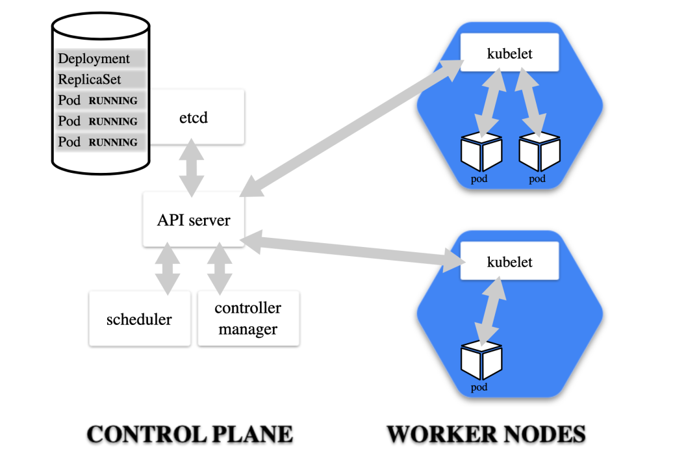

# Install Kubernetes

## Basic Terms: System Parts

- Kubernetes: The whole orchestration system
- K8s "k-eights" or Kube for short
- Kubectl: CLI to configure Kubernetes and manage apps
- Using "cube control" official pronunciation
- Node: Single server in the Kubernetes cluster
- Kubelet: Kubernetes agent running on nodes
- Control Plane: Set of containers that manage the
cluster
- Includes API server, scheduler, controller manager,
etcd, and more
- Sometimes called the "master"

## Kubernetes In A Browser

- Try [K8S](http://play-with-k8s.com) or katacoda.com in browser
- Easy to get started
- Doesn't keep your environment

## Docker Desktop

- Runs/configures Kubernetes Master containers
- Manages kubectl install and certs
- Easily install, disable, and remove from Docker GUI

## MiniKube

- Download Windows Installer from GitHub
- ```minikube-installer.exe```
- ```minikube start```
- Much like the docker-machine experience
- Creates a VirtualBox VM with Kubernetes master setup
- Doesn't install kubectl

## MicroK8s

- Installs Kubernetes (without Docker Engine) on localhost (Linux)
- Uses snap (rather then apt or yum) for install
- Control the MicroK8s service via ```microk8s.``` commands
- kubectl accessable via microk8s.kubectl
- Add CoreDNS for services to work
  - ```microk8s.enable dns```
- Add an alias to your shell (```.bash_profile```)
  - ```alias kubectl=microk8s.kubectl```

## Kubernetes Container Abstractions

- Pod: one or more containers running together on one Node
- Basic unit of deployment. Containers are always in pods
- Controller: For creating/updating pods and other objects
- Many types of Controllers inc. Deployment, ReplicaSet,
StatefulSet, DaemonSet, Job, CronJob, etc.
- Service: network endpoint to connect to a pod
- Namespace: Filtered group of objects in cluster
- Secrets, ConfigMaps, and more

## Kubernetes Run, Create, and Apply

- Kuberentes is evolving, and so is the CLI
- We get three ways to create pods from the kubectl CLI
  - ```kubectl run``` (changing to be only for pod creation)
  - ```kubectl create``` (create some resources via CLI or YAML)
  - ```kubectl apply``` (create/update anything via YAML)
- For now we'll just use ``run`` or ```create``` CLI
- Later we'll learn YAML and pros/cons of each

## Creating Pods with kubectl

- Are we working?
  - ```kubectl version```
- Two ways to deploy Pods (containers): Via commands, or via YAML
- Let's run a pod of the nginx web server!
  - ```kubectl create deployment my-nginx --image nginx```
- Let's list the pod
  - ```kubectl get pods```
- Let's see all objects
  - ```kubectl get all```

## Pods -ReplicaSet -Deployment

## Cleanup

- Let's remove the Deployment
  - ```kubectl delete deployment my-nginx```

## Scaling ReplicaSets

- Start a new deployment for one replica/pod
  - ```kubectl create deployment my-apache --image httpd```
- Let's scale it up with another pod
  - ```kubectl scale deploy/my-apache --replicas 2```
  - ```kubectl scale deployment my-apache --replicas 2```
- those are the same command
- deploy = deployment = deployments

## What Just Happened? kubectl scale



## Don't cleanup

- We'll use these httpd containers in the next lecture

## Inspecting Deployment Objects

- ```kubectl get pods```
- Get container logs
  - ```kubectl logs deployment/my-apache --follow --tail 1```
- Get a bunch of details about an object, including events!
  - ```kubectl describe pod/my-apache-xxxx-yyyy```
- Watch a command (without needing watch)
  - ```kubectl get pods -w```
- In a separate tab/window
  - ```kubectl delete pod/my-apache-xxxx-yyyy```
- Watch the pod get re-created
